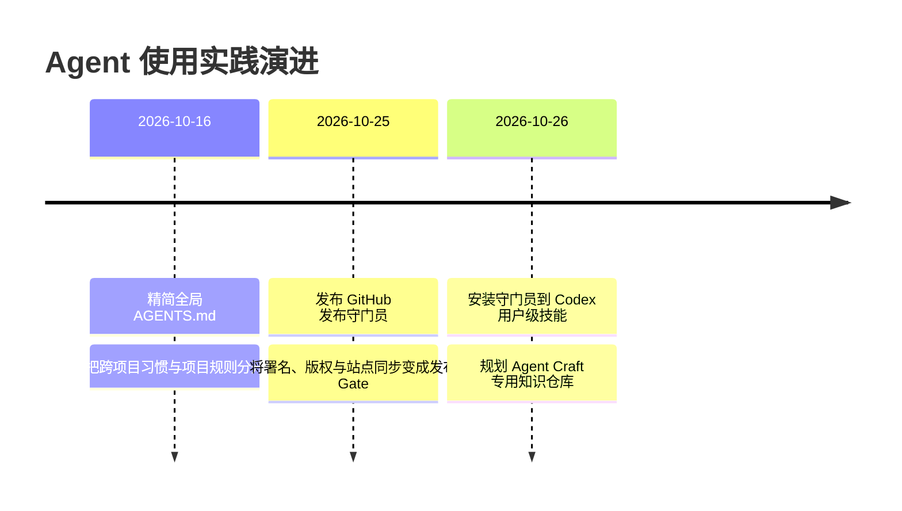
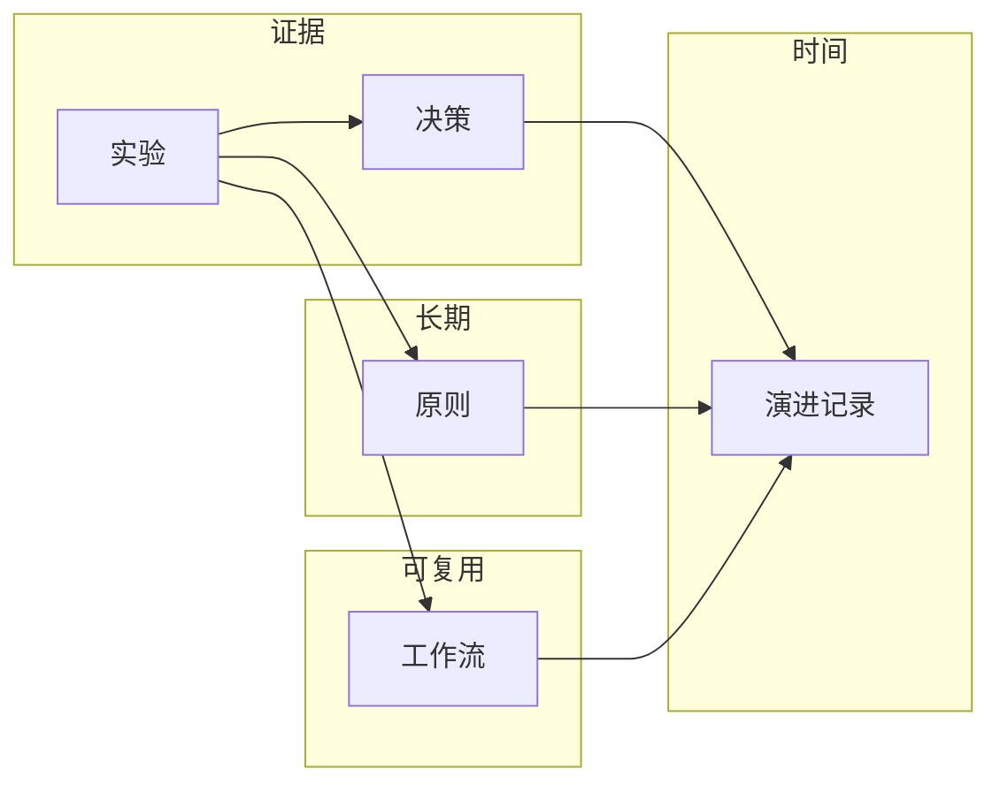

# 可视化演进

## 时间线

```mermaid
timeline
    title Agent 使用实践演进
    2026-10-16 : 精简全局 AGENTS.md
                : 把跨项目习惯与项目规则分开
    2026-10-25 : 发布 GitHub 发布守门员
                : 将署名、版权与站点同步变成发布 Gate
    2026-10-26 : 安装守门员到 Codex 用户级技能
                : 规划 Agent Craft 专用知识仓库
```

## 当前知识结构

```mermaid
flowchart LR
    subgraph 长期
        P[原则]
    end
    subgraph 可复用
        B[工作流]
    end
    subgraph 证据
        E[实验]
        D[决策]
    end
    subgraph 时间
        H[演进记录]
    end

    E --> P
    E --> B
    E --> D
    D --> H
    P --> H
    B --> H
```

## 更新规则

- 新节点只记录已经发生的事实。
- 认识变化时新增节点，并链接对应的实验或决策。
- 不为了图形好看删除旧分支；失效路径可以标为已放弃并附原因。
- 图变复杂后，再拆分到独立页面。
